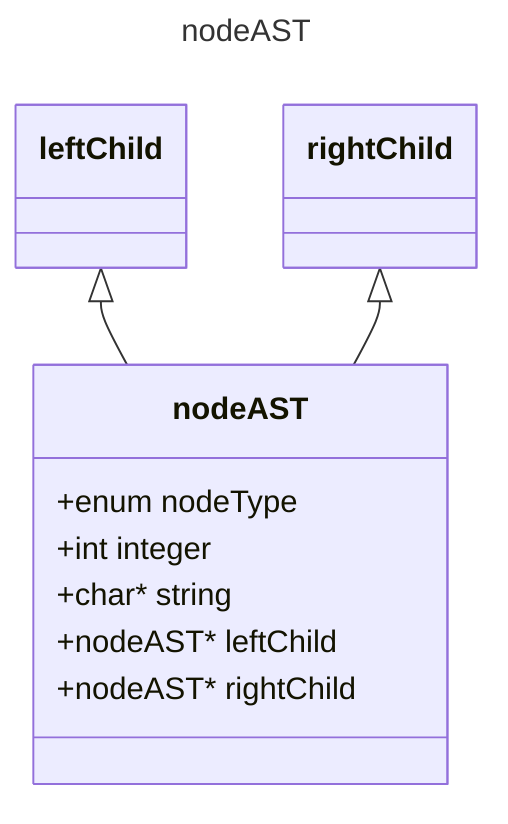
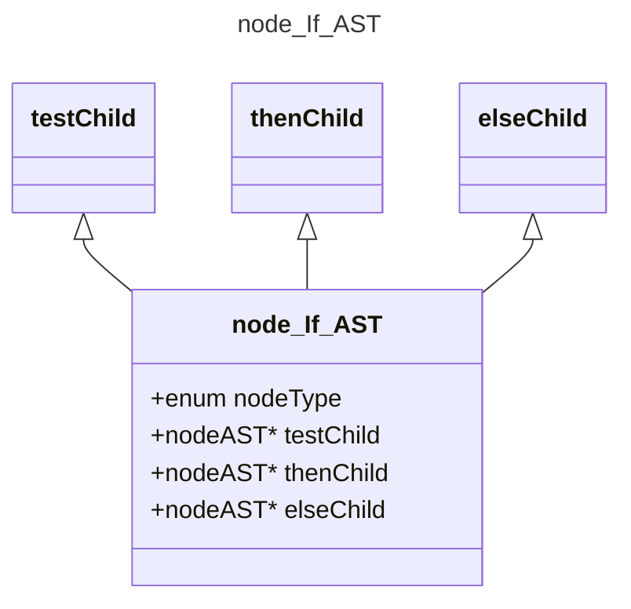
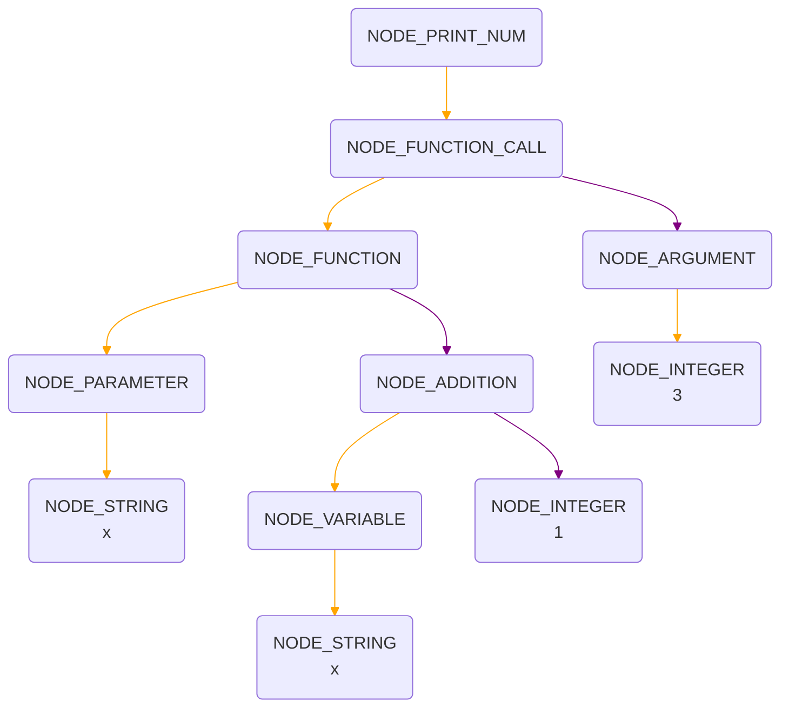

# Compiler final project

This project involves implementing an interpreter for variations of Scheme, a dialect of Lisp. However, the grammar of this language deviates slightly, and the functions implemented represent a subset of Scheme.

## Getting Started
You can compile it by two ways.
### 1. Shell script
```bash
bison -d -v -o mini_LISP.tab.c mini_LISP.y
gcc -c -g -I.. mini_LISP.tab.c
flex -o mini_LISP.yy.c mini_LISP.l
gcc -c -g -I.. mini_LISP.yy.c
gcc -c constructAST.c
gcc -o mini_LISP mini_LISP.tab.o mini_LISP.yy.o constructAST.o -ll
./mini_LISP < input.scm
```
### 2. CMake
```CMake
cmake_minimum_required(VERSION 3.23)
project(final_project C)

set(CMAKE_C_STANDARD 99)

# Find required packages
find_package(BISON)
find_package(FLEX)

# Generate parser and lexer files
BISON_TARGET(
        MyParser mini_LISP.y ${CMAKE_CURRENT_BINARY_DIR}/mini_LISP.tab.c
        VERBOSE mini_LISP.y.output
)
FLEX_TARGET(
        MyScanner mini_LISP.l  ${CMAKE_CURRENT_BINARY_DIR}/mini_LISP.yy.c
)
ADD_FLEX_BISON_DEPENDENCY(MyScanner MyParser)

# Include directories
include_directories(${CMAKE_CURRENT_BINARY_DIR} .)

# Compile the generated and other source files
add_executable(
        mini_LISP
        ${BISON_MyParser_OUTPUTS}
        ${FLEX_MyScanner_OUTPUTS}
        constructAST.c
)

# Link against the 'l' library
target_link_libraries(mini_LISP l)
```

## Status of Feature Implementation

### Basic Features

| No. | ~~~~~ Feature ~~~~~ | ~~~~~~~~~~~~~~~~~ Description ~~~~~~~~~~~~~~~~~~ | Points | Test Case |
|-----|---------------------|--------------------------------------------------|--------|-----------|
| 1.  | Syntax Validation   | Print “syntax error” when parsing invalid syntax | 10     |:o:        |
| 2.  | Print               | Implement print-num statement                    | 10     |:o:        |
| 3.  | Numerical Operations| Implement all numerical operations               | 25     |:o:        |
| 4.  | Logical Operations  | Implement all logical operations                 | 25     |:o:        |
| 5.  | if Expression       | Implement if expression                          | 8      |:o:        |
| 6.  | Variable Definition | Able to define a variable                        | 8      |:o:        |
| 7.  | Function            | Able to declare and call an anonymous function   | 8      |:o:        |
| 8.  | Named Function      | Able to declare and call a named function        | 6      |:o:        |

### Bonus Features

| No. | ~~~~~ Feature ~~~~~ | ~~~~~~~~~~~~~~~~~ Description ~~~~~~~~~~~~~~~~~~ | Points | Test Case |
|-----|---------------------|--------------------------------------------------|--------|-----------|
| 1.  | Recursion           | Support recursive function call                  | 5      |:o:        |
| 2.  | Type Checking       | Print error messages for type errors             | 5      |:construction:|
| 3.  | Nested Function     | Nested function (static scope)                   | 5      |:construction:|
| 4.  | First-class Function| Able to pass functions, support closure          | 5      |:construction:|


## AST Structure
Basic structure of nodes in AST is shown below.



Node Types are defined as follows.
* nodeType for leaf nodes
0. _`NODE_INTEGER`_
1. _`NODE_BOOLEAN`_
2. _`NODE_STRING`_
* nodeType for internal nodes
3. _`NODE_ADDITION`_
4. _`NODE_SUBTRACTION`_
5. _`NODE_MULTIPLICATION`_
6. _`NODE_DIVISION`_
7. _`NODE_MODULUS`_
8. _`NODE_GREATER`_
9. _`NODE_SMALLER`_
10. _`NODE_EQUAL`_
11. _`NODE_AND`_
12. _`NODE_OR`_
13. _`NODE_NOT`_
14. _`NODE_PRINT_NUM`_
15. _`NODE_PRINT_BOOL`_
16. _`NODE_IF_EXPRESSION`_
17. _`NODE_VARIABLE`_
18. _`NODE_DEFINE`_
19. _`NODE_PARAMETER`_
20. _`NODE_ARGUMENT`_
21. _`NODE_FUNCTION`_
22. _`NODE_FUNCTION_CALL`_
23. _`NODE_STATEMENT`_

Here are some examples of AST structure.

#### 7. Anonymous Funcion

```scheme
(print-num ((fun (x) (+ x 1)) 3))
```


