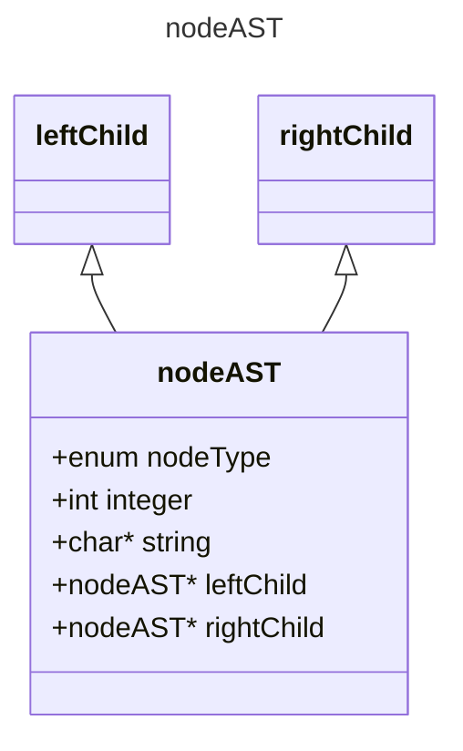
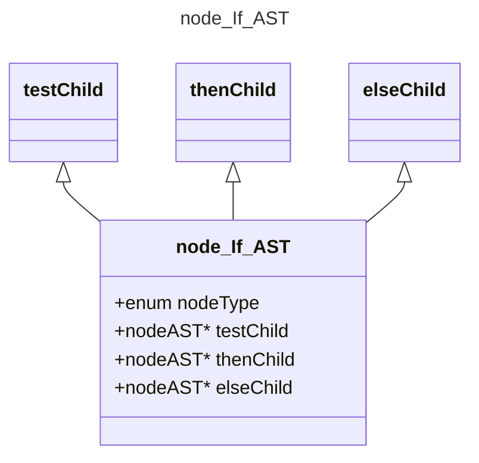
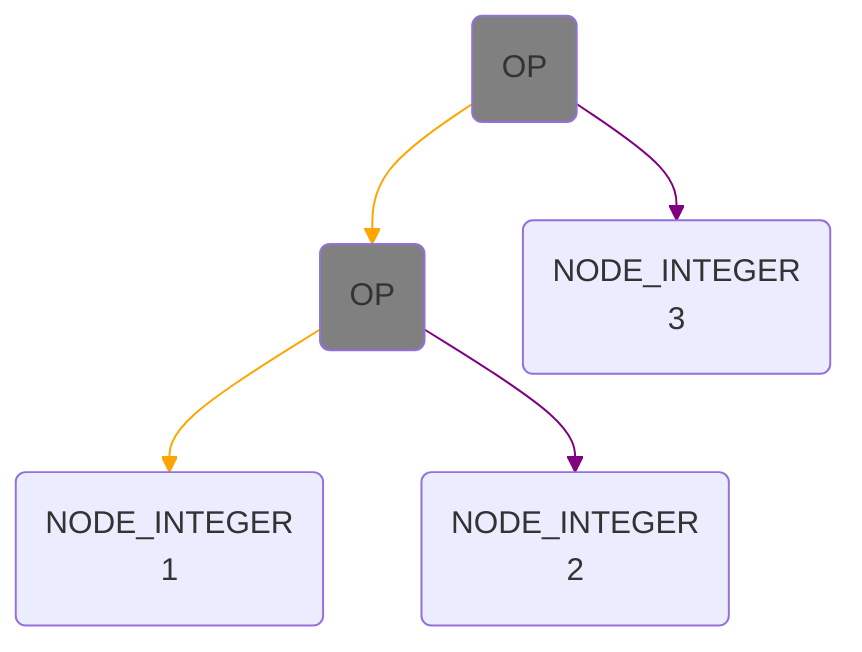
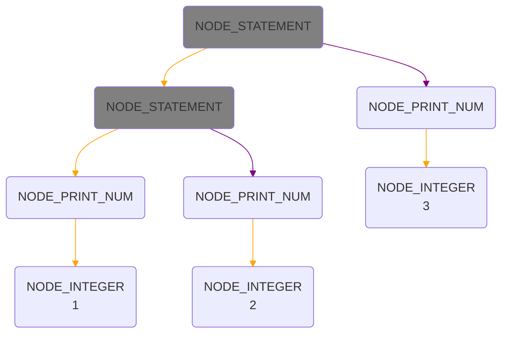
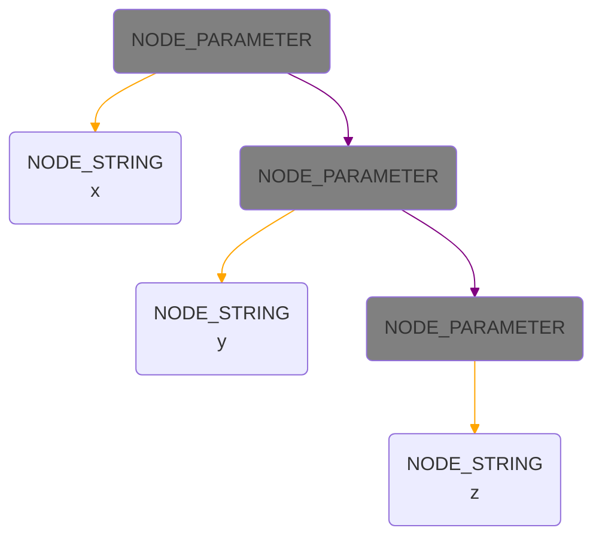
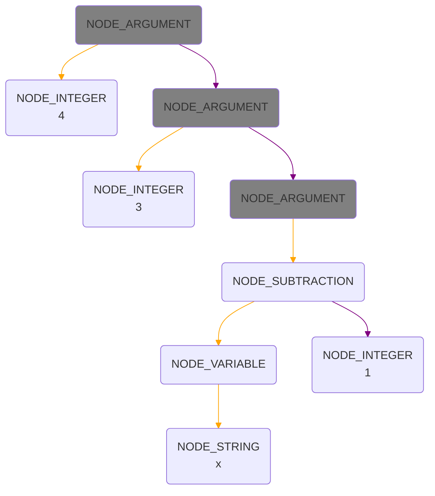
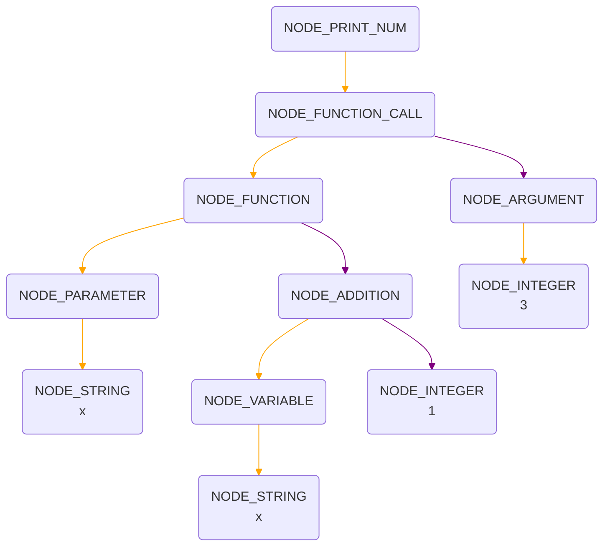
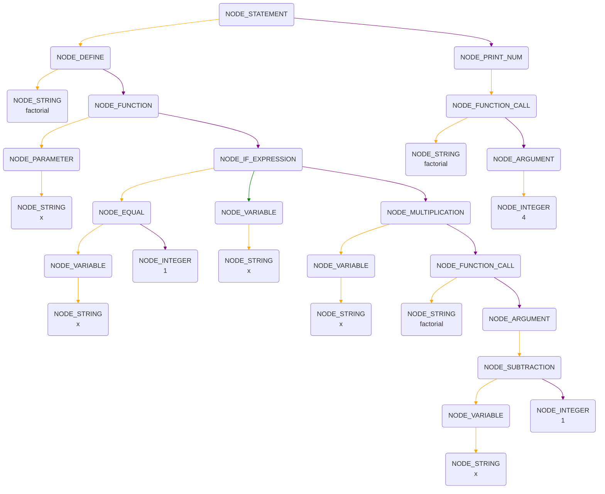

# Compiler
_Let's learn how to craft a compiler!_


## Course
* NCU CSIE
* course number: CE3006 at 2022

## Textbook
* [Crafting A Compiler](http://www.cs.nthu.edu.tw/~ychung/slides/CSC4180/Crafting%20a%20Compiler%20-%202010.pdf)
* [Compilers - Principles, Techniques, and Tools](http://www.cs.nthu.edu.tw/~ychung/slides/CSC4180/Alfred%20V.%20Aho,%20Monica%20S.%20Lam,%20Ravi%20Sethi,%20Jeffrey%20D.%20Ullman-Compilers%20-%20Principles,%20Techniques,%20and%20Tools-Pearson_Addison%20Wesley%20(2006).pdf)

## Prerequisite
* Data Structure
* Regular Expression
* Assembly Language

---

# Final project

This project involves implementing an interpreter for variations of Scheme, a dialect of Lisp.\
However, the grammar of this language deviates slightly, and the functions implemented represent a subset of Scheme.

## Getting Started
You can compile it by two ways.
### 1. Shell script
```bash
bison -d -v -o mini_LISP.tab.c mini_LISP.y
gcc -c -g -I.. mini_LISP.tab.c
flex -o mini_LISP.yy.c mini_LISP.l
gcc -c -g -I.. mini_LISP.yy.c
gcc -c constructAST.c
gcc -o mini_LISP mini_LISP.tab.o mini_LISP.yy.o constructAST.o -ll
./mini_LISP < input.scm
```
### 2. CMake
```CMake
cmake_minimum_required(VERSION 3.23)
project(final_project C)

set(CMAKE_C_STANDARD 99)

# Find required packages
find_package(BISON)
find_package(FLEX)

# Generate parser and lexer files
BISON_TARGET(
        MyParser mini_LISP.y ${CMAKE_CURRENT_BINARY_DIR}/mini_LISP.tab.c
        VERBOSE mini_LISP.y.output
)
FLEX_TARGET(
        MyScanner mini_LISP.l  ${CMAKE_CURRENT_BINARY_DIR}/mini_LISP.yy.c
)
ADD_FLEX_BISON_DEPENDENCY(MyScanner MyParser)

# Include directories
include_directories(${CMAKE_CURRENT_BINARY_DIR} .)

# Compile the generated and other source files
add_executable(
        mini_LISP
        ${BISON_MyParser_OUTPUTS}
        ${FLEX_MyScanner_OUTPUTS}
        constructAST.c
)

# Link against the 'l' library
target_link_libraries(mini_LISP l)
```

## Status of Feature Implementation

### Basic Features

| No. | ~~~~~ Feature ~~~~~ | ~~~~~~~~~~~~~~~~~ Description ~~~~~~~~~~~~~~~~~~ | Points | Test Case |
|-----|---------------------|--------------------------------------------------|--------|-----------|
| 1.  | Syntax Validation   | Print “syntax error” when parsing invalid syntax | 10     |:o:        |
| 2.  | Print               | Implement print-num statement                    | 10     |:o:        |
| 3.  | Numerical Operations| Implement all numerical operations               | 25     |:o:        |
| 4.  | Logical Operations  | Implement all logical operations                 | 25     |:o:        |
| 5.  | if Expression       | Implement if expression                          | 8      |:o:        |
| 6.  | Variable Definition | Able to define a variable                        | 8      |:o:        |
| 7.  | Function            | Able to declare and call an anonymous function   | 8      |:o:        |
| 8.  | Named Function      | Able to declare and call a named function        | 6      |:o:        |

### Bonus Features

| No. | ~~~~~ Feature ~~~~~ | ~~~~~~~~~~~~~~~~~ Description ~~~~~~~~~~~~~~~~~~ | Points | Test Case |
|-----|---------------------|--------------------------------------------------|--------|-----------|
| 1.  | Recursion           | Support recursive function call                  | 5      |:o:        |
| 2.  | Type Checking       | Print error messages for type errors             | 5      |:construction:|
| 3.  | Nested Function     | Nested function (static scope)                   | 5      |:construction:|
| 4.  | First-class Function| Able to pass functions, support closure          | 5      |:construction:|


## AST Structure
### Basic structure of nodes in AST is shown below.



### Node Types are defined as follows.
* nodeType for leaf nodes
0. _`NODE_INTEGER`_
1. _`NODE_BOOLEAN`_
2. _`NODE_STRING`_
* nodeType for internal nodes
3. _`NODE_ADDITION`_
4. _`NODE_SUBTRACTION`_
5. _`NODE_MULTIPLICATION`_
6. _`NODE_DIVISION`_
7. _`NODE_MODULUS`_
8. _`NODE_GREATER`_
9. _`NODE_SMALLER`_
10. _`NODE_EQUAL`_
11. _`NODE_AND`_
12. _`NODE_OR`_
13. _`NODE_NOT`_
14. _`NODE_PRINT_NUM`_
15. _`NODE_PRINT_BOOL`_
16. _`NODE_IF_EXPRESSION`_
17. _`NODE_VARIABLE`_
18. _`NODE_DEFINE`_
19. _`NODE_PARAMETER`_
20. _`NODE_ARGUMENT`_
21. _`NODE_FUNCTION`_
22. _`NODE_FUNCTION_CALL`_
23. _`NODE_STATEMENT`_

### Here are some examples of AST structure.

#### Addition, Muliplication, Equal

```scheme
(OP 1 2 3)
```



#### Statement

```scheme
(print-num 1)
(print-num 2)
(print-num 3)
```



#### Parameter

```scheme
(x y z)
```



#### Argument

```scheme
(function-name 4 3 (- x 1))
```



####  Anonymous Funcion

```scheme
(print-num ((fun (x) (+ x 1)) 3))
```



####  Recursion

```scheme
(define factorial
  (fun (x)
    (if
      (= x 1)
      x
      (* x (factorial (- x 1)))
    )
  )
)

(print-num (factorial 4))
```
        


```Latex
\[
a^b = 
\begin{cases} 
1 & \text{if } b = 0 \\
a \times a^{(b-1)} & \text{otherwise}
\end{cases}
\]
```


![StackFrame](data:image/svg+xml;base64,Cjxzdmcgd2lkdGg9IjMyMCIgaGVpZ2h0PSI1NTAiIHhtbG5zPSJodHRwOi8vd3d3LnczLm9yZy8yMDAwL3N2ZyI+CiAgPHRleHQgeD0iMzUiIHk9IjM1IiBmb250LXNpemU9IjE4Ij5lYnAtPjwvdGV4dD4KICA8dGV4dCB4PSIyNjUiIHk9IjM1IiBmb250LXNpemU9IjE4Ij48LWVzcDwvdGV4dD4KICA8cmVjdCB4PSIxMDAiIHk9IjEwIiB3aWR0aD0iMTUwIiBoZWlnaHQ9IjQwIiBzdHJva2U9InB1cnBsZSIgZmlsbD0iZ3JheSIvPgogIDx0ZXh0IHg9IjEyNSIgeT0iMzUiIGZvbnQtc2l6ZT0iMTgiPjR0aCBvbGQgZWJwPC90ZXh0PgogIDxyZWN0IHg9IjEwMCIgeT0iNTAiIHdpZHRoPSIxNTAiIGhlaWdodD0iNDAiIHN0cm9rZT0icHVycGxlIiBmaWxsPSJub25lIi8+CiAgPHRleHQgeD0iMTI1IiB5PSI3NSIgZm9udC1zaXplPSIxOCI+YT0yPC90ZXh0PgogIDxyZWN0IHg9IjEwMCIgeT0iOTAiIHdpZHRoPSIxNTAiIGhlaWdodD0iNDAiIHN0cm9rZT0icHVycGxlIiBmaWxsPSJub25lIi8+CiAgPHRleHQgeD0iMTI1IiB5PSIxMTUiIGZvbnQtc2l6ZT0iMTgiPmI9MDwvdGV4dD4KICA8cmVjdCB4PSIxMDAiIHk9IjEzMCIgd2lkdGg9IjE1MCIgaGVpZ2h0PSI0MCIgc3Ryb2tlPSJwdXJwbGUiIGZpbGw9ImdyYXkiLz4KICA8dGV4dCB4PSIxMjUiIHk9IjE1NSIgZm9udC1zaXplPSIxOCI+M3JkIG9sZCBlYnA8L3RleHQ+CiAgPHJlY3QgeD0iMTAwIiB5PSIxNzAiIHdpZHRoPSIxNTAiIGhlaWdodD0iNDAiIHN0cm9rZT0icHVycGxlIiBmaWxsPSJub25lIi8+CiAgPHRleHQgeD0iMTI1IiB5PSIxOTUiIGZvbnQtc2l6ZT0iMTgiPmE9MjwvdGV4dD4KICA8cmVjdCB4PSIxMDAiIHk9IjIxMCIgd2lkdGg9IjE1MCIgaGVpZ2h0PSI0MCIgc3Ryb2tlPSJwdXJwbGUiIGZpbGw9Im5vbmUiLz4KICA8dGV4dCB4PSIxMjUiIHk9IjIzNSIgZm9udC1zaXplPSIxOCI+Yj0xPC90ZXh0PgogIDxyZWN0IHg9IjEwMCIgeT0iMjUwIiB3aWR0aD0iMTUwIiBoZWlnaHQ9IjQwIiBzdHJva2U9InB1cnBsZSIgZmlsbD0iZ3JheSIvPgogIDx0ZXh0IHg9IjEyNSIgeT0iMjc1IiBmb250LXNpemU9IjE4Ij4ybmQgb2xkIGVicDwvdGV4dD4KICA8cmVjdCB4PSIxMDAiIHk9IjI5MCIgd2lkdGg9IjE1MCIgaGVpZ2h0PSI0MCIgc3Ryb2tlPSJwdXJwbGUiIGZpbGw9Im5vbmUiLz4KICA8dGV4dCB4PSIxMjUiIHk9IjMxNSIgZm9udC1zaXplPSIxOCI+YT0yPC90ZXh0PgogIDxyZWN0IHg9IjEwMCIgeT0iMzMwIiB3aWR0aD0iMTUwIiBoZWlnaHQ9IjQwIiBzdHJva2U9InB1cnBsZSIgZmlsbD0ibm9uZSIvPgogIDx0ZXh0IHg9IjEyNSIgeT0iMzU1IiBmb250LXNpemU9IjE4Ij5iPTM8L3RleHQ+CiAgPHJlY3QgeD0iMTAwIiB5PSIzNzAiIHdpZHRoPSIxNTAiIGhlaWdodD0iNDAiIHN0cm9rZT0icHVycGxlIiBmaWxsPSJncmF5Ii8+CiAgPHRleHQgeD0iMTI1IiB5PSIzOTUiIGZvbnQtc2l6ZT0iMTgiPjFzdCBvbGQgZWJwPC90ZXh0PgogIDxyZWN0IHg9IjEwMCIgeT0iNDEwIiB3aWR0aD0iMTUwIiBoZWlnaHQ9IjQwIiBzdHJva2U9InB1cnBsZSIgZmlsbD0ibm9uZSIvPgogIDx0ZXh0IHg9IjEyNSIgeT0iNDM1IiBmb250LXNpemU9IjE4Ij5hPTI8L3RleHQ+CiAgPHJlY3QgeD0iMTAwIiB5PSI0NTAiIHdpZHRoPSIxNTAiIGhlaWdodD0iNDAiIHN0cm9rZT0icHVycGxlIiBmaWxsPSJub25lIi8+CiAgPHRleHQgeD0iMTI1IiB5PSI0NzUiIGZvbnQtc2l6ZT0iMTgiPmI9MzwvdGV4dD4KICA8dGV4dCB4PSI4MiIgeT0iNTEwIiBmb250LXNpemU9IjIwIj5TdGFjayBncm93cyB1cHdhcmRzPC90ZXh0Pgo8L3N2Zz4K)


<svg width="320" height="550" xmlns="http://www.w3.org/2000/svg">
  <text x="35" y="35" font-size="18">ebp-></text>
  <text x="265" y="35" font-size="18"><-esp</text>
  <rect x="100" y="10" width="150" height="40" stroke="purple" fill="gray"/>
  <text x="125" y="35" font-size="18">4th old ebp</text>
  <rect x="100" y="50" width="150" height="40" stroke="purple" fill="none"/>
  <text x="125" y="75" font-size="18">a=2</text>
  <rect x="100" y="90" width="150" height="40" stroke="purple" fill="none"/>
  <text x="125" y="115" font-size="18">b=0</text>
  <rect x="100" y="130" width="150" height="40" stroke="purple" fill="gray"/>
  <text x="125" y="155" font-size="18">3rd old ebp</text>
  <rect x="100" y="170" width="150" height="40" stroke="purple" fill="none"/>
  <text x="125" y="195" font-size="18">a=2</text>
  <rect x="100" y="210" width="150" height="40" stroke="purple" fill="none"/>
  <text x="125" y="235" font-size="18">b=1</text>
  <rect x="100" y="250" width="150" height="40" stroke="purple" fill="gray"/>
  <text x="125" y="275" font-size="18">2nd old ebp</text>
  <rect x="100" y="290" width="150" height="40" stroke="purple" fill="none"/>
  <text x="125" y="315" font-size="18">a=2</text>
  <rect x="100" y="330" width="150" height="40" stroke="purple" fill="none"/>
  <text x="125" y="355" font-size="18">b=3</text>
  <rect x="100" y="370" width="150" height="40" stroke="purple" fill="gray"/>
  <text x="125" y="395" font-size="18">1st old ebp</text>
  <rect x="100" y="410" width="150" height="40" stroke="purple" fill="none"/>
  <text x="125" y="435" font-size="18">a=2</text>
  <rect x="100" y="450" width="150" height="40" stroke="purple" fill="none"/>
  <text x="125" y="475" font-size="18">b=3</text>
  <text x="82" y="510" font-size="20">Stack grows upwards</text>
</svg>

